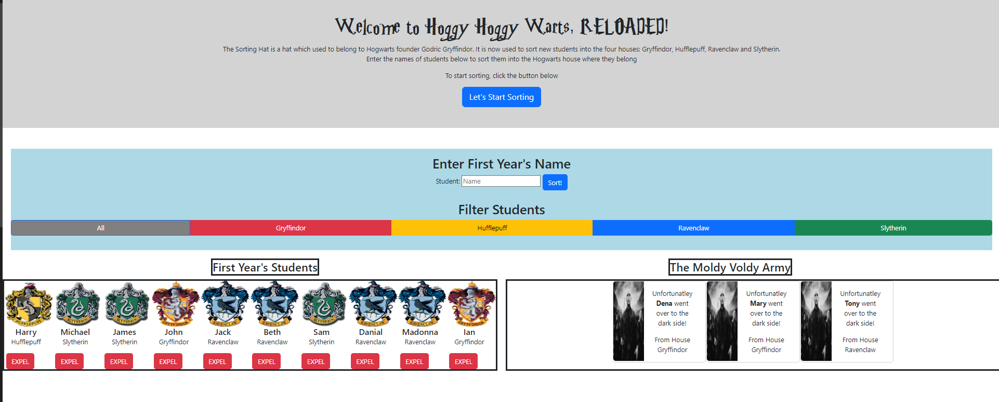

## Sorting Hat Project

## Overview of the project
Sorting hat project allows the user to enter students' names and they will randomly get assigned to a Hogwarts House.Users are allowed to expel students and the will be moved to the dark side. Also, this app allows the user to filter the student cards based on which Hogwarts house they're assigned to. 

## Link to Chie's wireframes/prototype
No wireframes were used for this project.

## Link to the deployed project

<https://mestany-sorting-hat.netlify.app/>

## Link to the project board

<>

## Description of the user
Any user

## List of features
* Welcome page appears with a start sorting button to start the app
* If you click the Sort button while the test field is blank, an alert message would appear
* When a student name is entered, a student card is created under the First Year's column and randomly assigned to a Hogwart house
* Click Expel button to move student to the dark side and the card would move to the Moldy Voldy Army
* Filtered button are available to show cards that are assigned to a specific house

## Screenshots of the project

## List of contributors and links to their GH profiles
<https://github.com/Mestany2>

## Link to Loom video walkthrough of the app
<https://www.loom.com/share/b675ebec3b414da2ab0d8a4da72a78ba>
